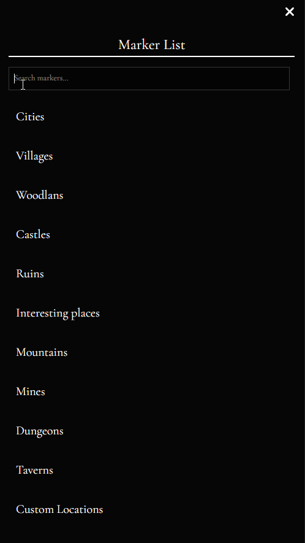
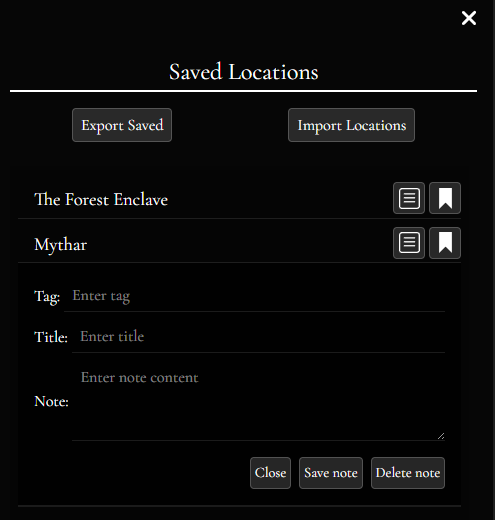
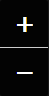
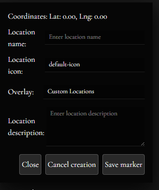
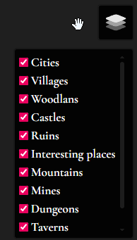

# Website Map & User Interface Guide

This document provides a visual guide to the application's interface, explaining the purpose of each component.

## 1. Sidebar Navigation
The main navigation is located on the left side of the screen. It allows switching between different information panes.

| Icon / View | Description | Image |
| :--- | :--- | :--- |
| **Navbar** | The main navigation bar containing icons for different panes. |  |
| **Map Description** | Displays general information about the currently viewed map. |  |
| **Location Description** | Shows details about a selected location or marker. |  |
| **Marker List** | A searchable list of all markers present on the current map. |  |
| **Saved Locations** | A personal list of saved locations/favorites. |  |
| **Settings** | Application settings pane. |  |

## 2. Marker Management Panels
Detailed views for managing and finding points of interest.

### Marker List
The marker list allows you to filter and find specific markers on the map. It supports categorization via dropdowns.



### Saved Markers
User-specific saved locations for quick access.

> **⚠️ Important:** Saved locations are stored in your browser's temporary memory. They **will be lost** if you refresh the page or close the tab. Always export your data if you wish to keep it.

**Features:**
- **Personal Notes:** You can attach private notes (with tags and titles) to any saved location.
- **Export to JSON:** Download your saved locations, including your notes and overlay information, to a backup file.
- **Import from JSON:** Restore your locations by uploading a previously exported JSON file.

**Example Export Format:**
```json
[
  {
    "marker_name": "Mythar",
    "marker_lat": "40.58",
    "marker_lng": "-72.42",
    "location_desc": "",
    "icon_name": "ruins-icon",
    "icon_link": "https://cdn.custommapsproject.cc/icons/ruins_icon.svg",
    "marker_img": null,
    "overlay_name": "Ruins",
    "note": {
      "note_tag": "Quest",
      "note_title": "Test quest",
      "note_content": "This is a test quest note"
    }
  }
]
```


## 3. Map Controls (Leaflet Interface)
Overlay controls located directly on the map surface.

| Component | Description | Image |
| :--- | :--- | :--- |
| **Zoom Controls** | Standard +/- buttons to zoom in and out. |  |
| **Map Reset** | Quickly resets the view to the default position. |  |
| **Fullscreen** | Toggles fullscreen mode for immersive viewing. |  |
| **Layers Toggle** | Switch between different map layers or overlays. |  |

## 4. Editing & Creation Tools
Tools for administrators or users to add content to the map.

### Creating Markers
To add a new marker, toggle the creation input mode.
1. **Enable Creation Mode**:
   
2. **Place Marker**:
   
3. **Input Data**:
   

## 5. Overlays
Toggle specific visual overlays (like political borders, climate zones, etc.) on top of the base map.

